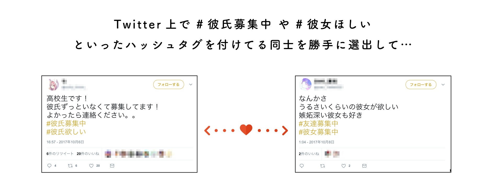
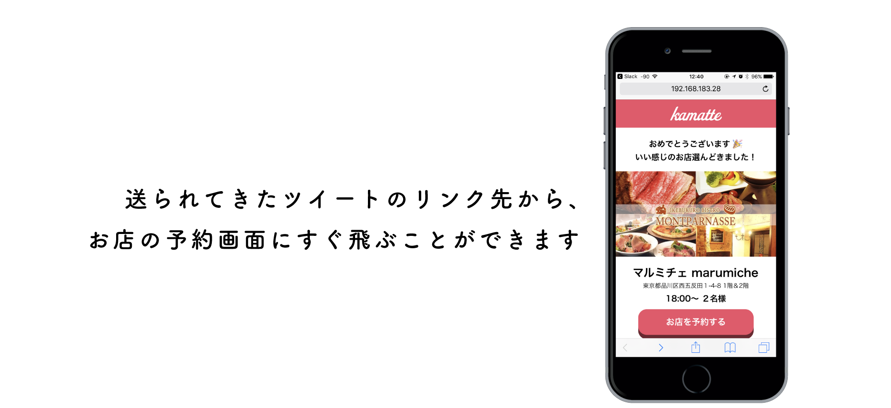

## 1.はじめに

## 2. 製品概要

### 背景(製品開発のきっかけ、課題等）
ターゲットであるかまってちゃんの特徴は、とにかく「#彼氏欲しい」や「#彼女欲しい人RT」出会いを求める

#### かまってちゃんが待っているもの、それは誰かからの「返信」
ターゲットであるかまってちゃんの特徴は、とにかく「#彼氏欲しい」や「#彼女欲しい人RT」で常に出会いを求める傾向にある。だがしかいお互いは受動的であるため、返信が来るのはごくまれなことである。
そこで、つねに受動的なかまってちゃん同士を勝手に仲介できるサービスがあればこれを解決することができると考え、このサービスが生まれた。

## 3. 使用方法
かまってちゃんが多いとされるtwitterのTLから、サーバが一定の時間おきにかまってちゃんの選出と最適化されたマッチングを行うため、実質マッチングまではユーザは何もしなくて良い。
マッチングすると公式アカウントからメンションが飛んでくるので、レコメンドされたお店を予約を完了し、デートまで持ち込むことで両者の需要を最大限まで満たすことができる。

## 4. 特長
- 会員登録などが一切不要
- お互いの需要を満たした相手とマッチングするため、成功しやすい
- 受動的にマッチングが行われるため、下心がカムフラージュされる
- マッチングが完了すると、twitterにOGP画像とともにメンションが飛ばされるので、マッチング成立時のドキドキ感が得られる

- お店をレコメンドしてくれるのでお店を選ぶ手間がない

## 5. 注力したこと（こだわり等）
- サーバーレスな構成のため運用コストが低い
- マッチング時にOGP画像を生成することで、インパクトを与えれるようにした

## 6. 今後の展望
- かまってほしくないユーザー向けに「かまってほしくない」ボタンを設置
- 課金体系
- グルメサイト等との連携によるマネタイズ
- 対象エリアの拡大

## 7. 技術的情報など
### AWS - Serverless Architecture で構成
- Lambda
- API Gateway
- DynamoDB
- CloudFront
- S3
- CloudFormation

### Vue.js(説明をmotokkiさんから)

### 使用API
- Hotpepper API
- Twitter Streaming API

### 活用した技術
- serverless
- NoSQL

#### デバイス
- とくになし

### 独自技術
- かまってちゃんのための最適マッチング

## さいごに
- kamatteをつかえば...

